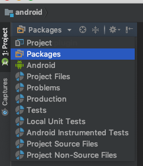
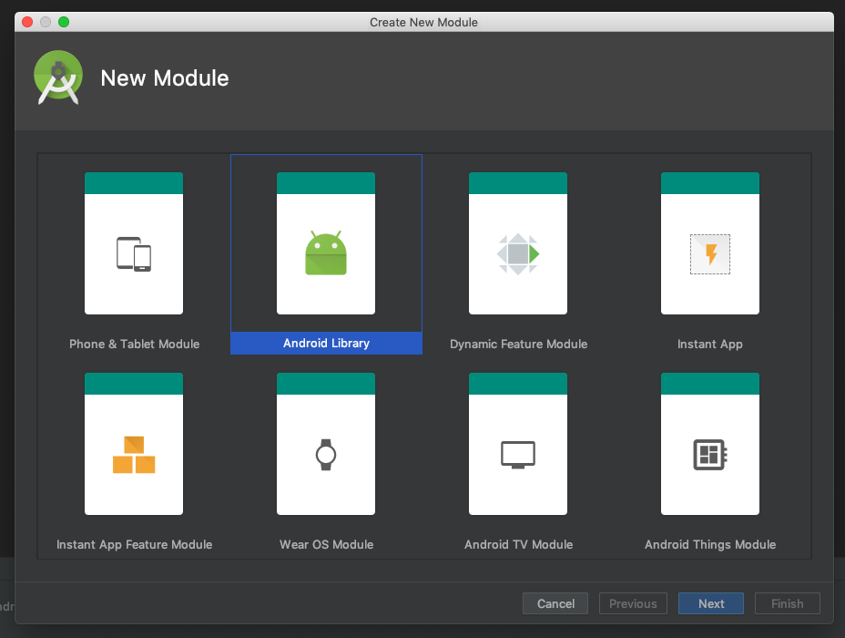
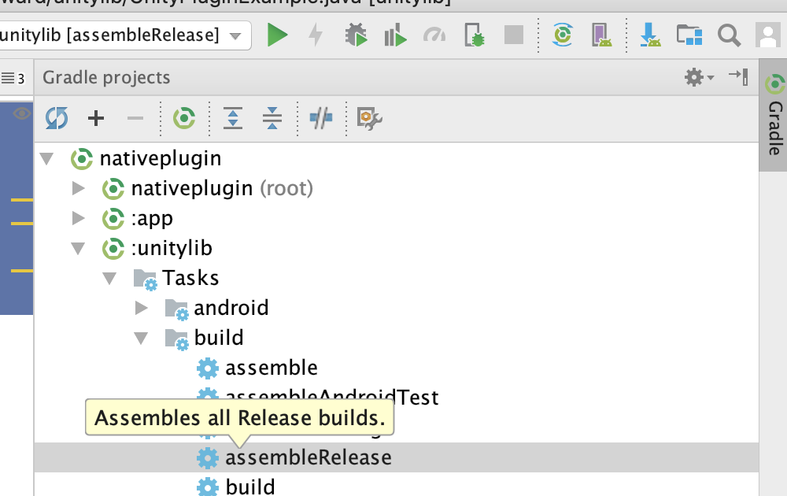

# Part 1: Hello World

## Writing a library

Create a new empty android project with no activity within Android Studio



Note that you can select project or package view with the above top left project view panel as well as rick-clicking to get project settings.

1) Right click on the project and create a new module, select android library



2) Remove the old app plugin by applying the following steps

    * Right click on the Project and select “Open module settings”
    * Select the module you want to delete and press the minus button above.
    * Apply changes

3) Write the plugin in java

```java
package com.dashforward.unityplugin;
import android.util.Log;

public class UnityPluginExample {
  private static String TAG = "SampleUnityPlugin";

  public void _ConsoleLog(String message) {
    Log.d(TAG, message);
  }
}
```

4) Build the library and copy it to your Unity project.




## Calling from C#

//todo
